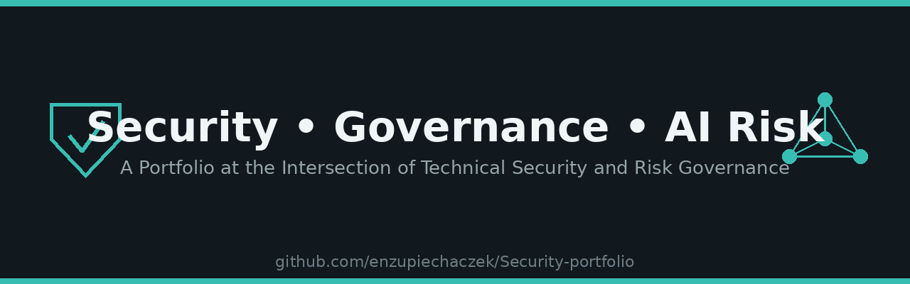

# Security & Governance Portfolio

A portfolio of practical projects focused on **information security, AI governance, risk management, and security operations**\. The projects are designed to demonstrate both technical security capability and the governance, documentation, and assurance practices required to operationalise security within an organisation\.

## Projects

### 🛡️ [Log Analyzer](./Log-Analyzer)
A lightweight Python tool that parses SSH authentication logs and flags brute-force login attempts, combining practical security automation with defensive-side thinking developed through penetration testing labs.

**Skills demonstrated:** Python scripting, regex pattern matching, log parsing, brute-force attack detection.

### 📋 [AI Governance Toolkit](./AI-Governance-Toolkit)
A practical toolkit demonstrating how organisations can maintain visibility and control over AI systems, including a populated AI system register, risk scoring methodology, policy template, and framework mapping to NIST AI RMF and ISO/IEC 42001.

**Demonstrates:** AI governance, risk assessment, policy development, framework alignment, register design, and governance documentation.

## Focus Areas

* Information security governance
* AI governance
* Risk management
* Security documentation
* Governance registers
* Security operations support
* Python automation
* Defensive security

## About This Portfolio

This portfolio reflects my interest in building security capabilities that combine technical security, governance, risk, and operational discipline.
